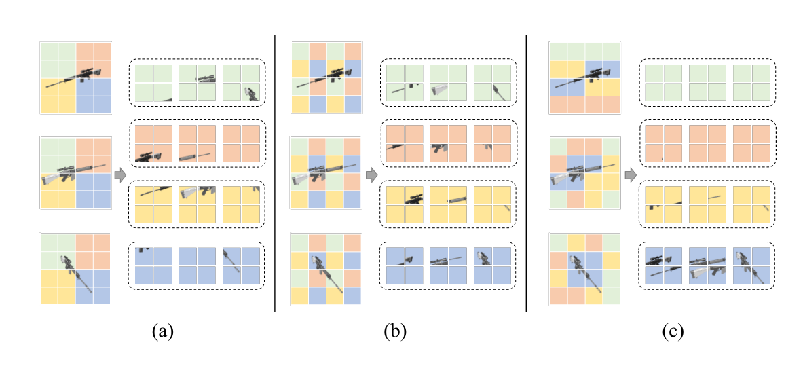
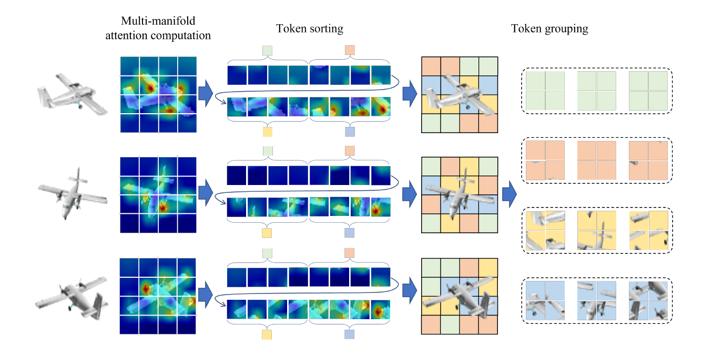

# Dynamic-Grouping-with-Multi-Manifold-Attention-for-Multi-View-3D-Object-Reconstruction
Official PyTorch implementation of the paper:  [Dynamic Grouping with Multi-Manifold Attention for Multi-View 3D Object Reconstruction (DGMA)](https://ieeexplore.ieee.org/abstract/document/10721458)

**Authors**: Georgios Kalitsios, Dimitrios Konstantinidis, Petros Daras, Kosmas Dimitropoulos.

## Visual Computing Lab (VCL)@CERTH/ITI

## Abstract:
In a multi-view 3D reconstruction problem, the task is to infer the 3D shape of an object from various images taken from different viewpoints. Transformer-based networks have demonstrated their ability to achieve high performance in such problems, but they face challenges in identifying the optimal way to merge the different views in order to estimate with great fidelity the 3D shape of the object. This work aims to address this issue by proposing a novel approach to compute information-rich inter-view features by combining image tokens with similar distinctive characteristics among the different views dynamically. This is achieved by leveraging the self-attention mechanism of a Transformer, enhanced with a multi-manifold attention module, to estimate the importance of image tokens on-the-fly and re-arrange them among the different views in a way that improves the viewpoint merging procedure and the 3D reconstruction results. Experiments on ShapeNet and Pix3D validate the ability of the proposed method to achieve state-of-the-art performance in both multi-view and single-view 3D object reconstruction.

## DGMA Concept:
<p align="center">
  
  <br>
  <i>Caption: While previous 3D reconstruction approaches utilize (a) short- and (b) long-range token groupings based on fixed positions, thus mixing foreground object parts and background, the proposed Dynamic Grouping with Multi-manifold Attention (DGMA) method (c) performs an attention-based dynamic grouping, allowing the disentanglement of foreground object parts from the background in the subsequent token groups.</i>
</p>

## DGMA Architecture 
<p align="center">
  
  <br>
  <i>Caption: Illustration of the architecture of the proposed DGMA method.</i>
</p>
<p align="center">
  
  <br>
  <i>Caption: Illustration of the proposed dynamic grouping strategy. Leveraging the computed attention maps, view-specific tokens are sorted dynamically
based on their attention values and placed in groups with each group, indicated by a different color, containing tokens of similar distinctive characteristics.</i>
</p>

## Performance

| Methods                                                      | 1 view          | 2 views         | 3 views         | 4 views         | 5 views         | 8 views         | 12 views        | 16 views        | 20 views        |
| ------------------------------------------------------------ | --------------- | --------------- | --------------- | --------------- | --------------- | --------------- | --------------- | --------------- | --------------- |
| [3D-R2N2](https://github.com/chrischoy/3D-R2N2)              | 0.560 / 0.351   | 0.603 / 0.368   | 0.617 / 0.372   | 0.625 / 0.378   | 0.634 / 0.382   | 0.635 / 0.383   | 0.636 / 0.382   | 0.636 / 0.382   | 0.636 / 0.383   |
| [AttSets](https://github.com/Yang7879/AttSets)               | 0.642 / 0.395   | 0.662 / 0.418   | 0.670 / 0.426   | 0.675 / 0.430   | 0.677 / 0.432   | 0.685 / 0.444   | 0.688 / 0.445   | 0.692 / 0.447   | 0.693 / 0.448   |
| [Pix2Vox++](https://github.com/hzxie/Pix2Vox)                | 0.670 / 0.436   | 0.695 / 0.452   | 0.704 / 0.455   | 0.708 / 0.457   | 0.711 / 0.458   | 0.715 / 0.459   | 0.717 / 0.460   | 0.718 / 0.461   | 0.719 / 0.462   |
| [EVolT](https://openaccess.thecvf.com/content/ICCV2021/papers/Wang_Multi-View_3D_Reconstruction_With_Transformers_ICCV_2021_paper.pdf) | - / -           | - / -           | - / -           | 0.609 / 0.358   | - / -           | 0.698 / 0.448   | 0.720 / 0.475   | 0.729 / 0.486   | 0.735 / 0.492   |
| [LegoFormer](https://github.com/faridyagubbayli/LegoFormer)  | 0.519 / 0.282   | 0.644 / 0.392   | 0.679 / 0.428   | 0.694 / 0.444   | 0.703 / 0.453   | 0.713 / 0.464   | 0.717 / 0.470   | 0.719 / 0.472   | 0.721 / 0.472   |
| [3D-C2FT](https://github.com/bluestyle97/awesome-3d-reconstruction-papers) | 0.629 / 0.371   | 0.678 / 0.424   | 0.695 / 0.443   | 0.702 / 0.452   | 0.702 / 0.458   | 0.716 / 0.468   | 0.720 / 0.475   | 0.723 / 0.477   | 0.724 / 0.479   |
| [3D-RETR <br> <font size=2>(3 view)</font>](https://github.com/fomalhautb/3D-RETR) | 0.674 / -       | 0.707 / -       | 0.716 / -       | 0.720 / -       | 0.723 / -       | 0.727 / -       | 0.729 / -       | 0.730 / -       | 0.731 / -       |
| [GARNet](https://github.com/GaryZhu1996/GARNet)              | 0.673 / 0.418   | 0.705 / 0.455   | 0.716 / 0.468   | 0.722 / 0.475   | 0.726 / 0.479   | 0.731 / 0.486   | 0.734 / 0.489   | 0.736 / 0.491   | 0.737 / 0.492   |
| [GARNet+](https://github.com/GaryZhu1996/GARNet)             | 0.655 / 0.399   | 0.696 / 0.446   | 0.712 / 0.465   | 0.719 / 0.475   | 0.725 / 0.481   | 0.733 / 0.491   | 0.737 / 0.498   | 0.740 / 0.501   | 0.742 / 0.504   |
| [UMIFormer](https://github.com/GaryZhu1996/UMIFormer)        | 0.6802 / 0.4281 | 0.7384 / 0.4919 | 0.7518 / 0.5067 | 0.7573 / 0.5127 | 0.7612 / 0.5168 | 0.7661 / 0.5213 | 0.7682 / 0.5232 | 0.7696 / 0.5245 | 0.7702 / 0.5251 |
| [UMIFormer+](https://github.com/GaryZhu1996/UMIFormer)       | 0.5672 / 0.3177 | 0.7115 / 0.4568 | 0.7447 / 0.4947 | 0.7588 / 0.5104 | 0.7681 / 0.5216 | 0.7790 / 0.5348 | 0.7843 / 0.5415 | 0.7873 / 0.5451 | 0.7886 / 0.5466 |
| [LRGT](https://github.com/LiyingCV/Long-Range-Grouping-Transformer)       | 0.6962 / 0.4461 | 0.7462 / 0.5005 | 0.7590 / 0.5148 | 0.7653 / 0.5214 | 0.7692 / 0.5257 | 0.7744 / 0.5311 | 0.7766 / 0.5337 | 0.7781 / 0.5347 | 0.7786 / 0.5353 |
| [LRGT+](https://github.com/LiyingCV/Long-Range-Grouping-Transformer)      | 0.5847 / 0.3378 | 0.7145 / 0.4618 | 0.7476 / 0.4989 | 0.7625 / 0.5161 | 0.7719 / 0.5271 | 0.7833 / 0.5403 | 0.7888 / 0.5467 | 0.7912 / 0.5497 | 0.7922 / 0.5510 |
| DGMA (Ours)                                                  | 0.6987 / 0.4518 | 0.7487 / 0.5041 | 0.7632 / 0.5204 | 0.7692 / 0.5265 | 0.7734 / 0.5307 | 0.7781 / 0.5353 | 0.7800 / 0.5375 | 0.7810 / 0.5380 | 0.7812 / 0.5383 |
| DGMA+ (Ours)                                                 | 0.5961 / 0.3475 | 0.7173 / 0.4668 | 0.7518 / 0.5057 | 0.7666 / 0.5227 | 0.7767 / 0.5345 | 0.7876 / 0.5470 | 0.7934 / 0.5539 | 0.7962 / 0.5570 | 0.7974 / 0.5585 |


## Installation
The environment was tested on Ubuntu 20.04.5 LTS. We trained DGMA on 2 NVidia RTX 3090Ti GPUs 

Clone the code repository
```
git clone https://github.com/george-kalitsios/DGMA.git

```

Create a new environment from ```environment.yml```
```
conda env create -f environment.yml
conda activate dgma
```
Or install Python dependencies
```
cd DGMA
conda create -n dgma python=3.6
pip install -r requirements.txt
```

## Datasets

We use the [ShapeNet](https://www.shapenet.org/) and [Pix3D](http://pix3d.csail.mit.edu/) in our experiments, which are available below:

- ShapeNet rendering images: http://cvgl.stanford.edu/data2/ShapeNetRendering.tgz
- ShapeNet voxelized models: http://cvgl.stanford.edu/data2/ShapeNetVox32.tgz
- Pix3D images & voxelized models: http://pix3d.csail.mit.edu/data/pix3d.zip

#### Update Settings in `config.py`

You need to update the file path of the datasets:

```
__C.DATASETS.SHAPENET.TAXONOMY_FILE_PATH   = './datasets/ShapeNet.json'
__C.DATASETS.SHAPENET.RENDERING_PATH       = '/PATH/TO/ShapeNet/ShapeNetRendering/%s/%s/rendering/%02d.png'
__C.DATASETS.SHAPENET.VOXEL_PATH           = '/PATH/TO/ShapeNet/ShapeNetVox32/%s/%s/model.binvox'
__C.DATASETS.PIX3D.ANNOTATION_PATH          = '/PATH/TO/Pix3D/pix3d.json'
__C.DATASETS.PIX3D.RENDERING_PATH           = '/PATH/TO/Pix3D/img/%s/%s.%s'
__C.DATASETS.PIX3D.VOXEL_PATH               = '/PATH/TO/model/%s/%s/%s.binvox'
__C.DATASETS.PIX3D.TAXONOMY_FILE_PATH       = '/PATH/TO/Pix3D.json'
```

## Pretrained Models

The pretrained models on ShapeNet are available as follows:
- [DGMA](https://drive.google.com/file/d/1mlqMUDg7Ca3a_qOcKm8sK4HnMphef4eO/view?usp=drive_link)
- [DGMA+](https://drive.google.com/file/d/1rA86iMPmEUw7HRBA1Jv5q88jiy7aRJmr/view?usp=drive_link)

## Get start

### Training
We provide the training script, which you can run as following: `sh train.sh`.

We use `torch.distributed` for multiple GPU training; therefore, you can change `CUDA_VISIBLE_DEVICES` and `nproc_per_node` to use more devices or only one device.

or
```
Single GPU:
CUDA_VISIBLE_DEVICES=0 python -m torch.distributed.launch --nproc_per_node=1 runner.py

Two GPUs:
CUDA_VISIBLE_DEVICES=0,1 python -m torch.distributed.launch --nproc_per_node=2 runner.py
```
### Evaluation
We provide the testing script, which you can run as following: `sh test.sh`

or
```
Single GPU:
CUDA_VISIBLE_DEVICES=0 python -m torch.distributed.launch --nproc_per_node=1 runner.py --test

Two GPUs:
CUDA_VISIBLE_DEVICES=0,1 python -m torch.distributed.launch --nproc_per_node=2 runner.py --test
```

## Citation

If you find our code or paper useful in your research, please consider citing:
```BibTex
@ARTICLE{10721458,
  author={Kalitsios, Georgios and Konstantinidis, Dimitrios and Daras, Petros and Dimitropoulos, Kosmas},
  journal={IEEE Access}, 
  title={Dynamic Grouping with Multi-Manifold Attention for Multi-View 3D Object Reconstruction}, 
  year={2024},
  volume={},
  number={},
  pages={1-1},
  keywords={Three-dimensional displays;Image reconstruction;Transformers;Solid modeling;Computational modeling;Vectors;Surface reconstruction;Object recognition;Computer vision;Training;Dynamic grouping;Multi-manifold attention;Multi-view 3D reconstruction;Transformer;Voxel representation},
  doi={10.1109/ACCESS.2024.3483434}}
```

## Acknowledgment
"Thanks to the [LRGT](https://github.com/LiyingCV/Long-Range-Grouping-Transformer) team for their work and contributions."

## Futher Information

Please check out other works from our group:
- [Multi-manifold Attention for Vision Transformers (IEEE Access 2023)](https://ieeexplore.ieee.org/document/10305583)

